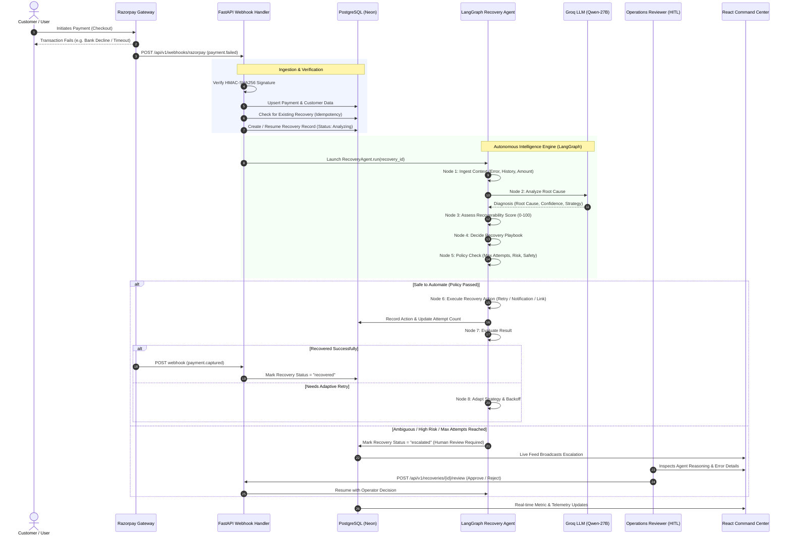

# Complete System & Agent Lifecycle Flow

This document details the complete end-to-end execution flow of the Autonomous Payment Recovery Agent, including architecture diagrams, state machine transitions, and real-world scenario walkthroughs.

---

## 1. End-to-End Architecture Flow Diagram



---

## 2. LangGraph State Machine Workflow

The LangGraph orchestration coordinates nine specialized nodes:

```text
               ┌──────────────────────┐
               │     ingest_event     │
               └──────────┬───────────┘
                          │
                          ▼
               ┌──────────────────────┐
               │    analyze_failure   │◄─── (Groq LLM / Deterministic Classifier)
               └──────────┬───────────┘
                          │
                          ▼
               ┌──────────────────────┐
               │ assess_recoverability│◄─── (0-100 Scoring Engine)
               └──────────┬───────────┘
                          │
                          ▼
               ┌──────────────────────┐
               │    decide_strategy   │
               └──────────┬───────────┘
                          │
                          ▼
               ┌──────────────────────┐
        ┌─────►│     policy_check     │
        │      └──────────┬───────────┘
        │                 │
        │         ┌───────┴──────────────────────┐
        │         │ Policy Passed                │ Policy Blocked / Final
        │         ▼                              ▼
        │  ┌───────────────┐           ┌───────────────────┐
        │  │ execute_action│           │ finalize_recovery │──► [END]
        │  └──────┬────────┘           └───────────────────┘
        │         │
        │         ▼
        │  ┌───────────────┐
        │  │evaluate_result│
        │  └──────┬────────┘
        │         │
        │         ├──────────────────────────────┐
        │         │ Result Needs Adaptation      │ Successful or Terminal
        │         ▼                              ▼
        │  ┌───────────────┐           ┌───────────────────┐
        └──│ adapt_strategy│           │ finalize_recovery │──► [END]
           └───────────────┘           └───────────────────┘
```

---

## 3. Node-by-Node Execution Breakdown

### Node 1: `ingest_event`
* **Input**: `payment_id`, `recovery_id`.
* **Action**: Fetches payment record, customer history (previous successful transactions, success rate, tenure), and prior recovery attempts.
* **Output**: Hydrated `RecoveryState` with full contextual metadata.

### Node 2: `analyze_failure`
* **Action**:
  1. Invokes Groq LLM (`qwen/qwen3.8-27b`) with structured schema output (`FailureAnalysisResult`).
  2. Falls back instantly to regex/keyword rules if LLM is unavailable or offline.
* **Output**: `root_cause` (e.g., `bank_decline`), `root_cause_confidence` (0.0 to 1.0), and `explanation`.

### Node 3: `assess_recoverability`
* **Action**: Executes the mathematical scoring engine:
  $$\text{Score} = \text{Base}(50) + \text{CauseWeight} + (\text{Confidence} \times 10) - \text{AttemptPenalty} + \text{CustomerBonus}$$
* **Output**: `recoverability_score` ($0\text{–}100$) and `recoverability_category` (`high`, `medium`, `low_recoverability`).

### Node 4: `decide_strategy`
* **Action**: Maps diagnosis and score category to recovery playbook:
  * `temporary_bank_error` $\to$ `temporary_failure` (Backoff auto-retry)
  * `network_timeout` $\to$ `network_timeout` (Immediate or delayed retry)
  * `upi_failure` $\to$ `upi_failure` (Deep-link retry notification)
  * `low_recoverability` $\to$ `low_recoverability` (Payment link with alternative method)
  * `suspected_risk` $\to$ `escalate` (Immediate human escalation)

### Node 5: `policy_check`
* **Action**: Evaluates strict safety constraints before any money movement:
  * Check: Has `attempt_count` reached `max_attempts` (3)?
  * Check: Has sufficient backoff cooling time passed?
  * Check: Is this a high-risk or fraud-flagged transaction?
* **Routing**:
  * **Pass**: Proceeds to `execute_action`.
  * **Violation**: Sets `status = "escalated"`, reason `"Max retry attempts reached"` or `"High risk transaction"`, and routes to `finalize_recovery`.

### Node 6: `execute_action`
* **Action**: Executes the concrete operation:
  * Dispatches SMS/Email notification with personalized recovery payment link.
  * Initiates gateway retry request.
  * Records execution in `recovery_actions` table with completed timestamp and parameters.
  * Increments recovery attempt count capped at `max_attempts`.

### Node 7: `evaluate_result`
* **Action**: Checks whether the recovery attempt resolved the payment or if the customer initiated an alternative attempt.

### Node 8: `adapt_strategy`
* **Action**: If an initial retry fails, switches strategy (e.g., from direct bank retry to alternative payment method link) and increases backoff intervals.

### Node 9: `finalize_recovery`
* **Action**: Commits final state (`recovered`, `escalated`, or `exhausted`), appends audit log record, and notifies the operations dashboard.

---

## 4. Human-in-the-Loop (HITL) Lifecycle

```text
┌──────────────────────────────────────────────────────────┐
│                   Escalation Triggers                    │
│  - Low recoverability score (< 33/100)                   │
│  - Ambiguous failure code                                │
│  - Max automated attempts reached (3 / 3)                │
│  - Fraud / Risk flag detected                            │
└────────────────────────────┬─────────────────────────────┘
                             │
                             ▼
┌──────────────────────────────────────────────────────────┐
│              Recovery Status = "escalated"               │
│  - Live feed displays amber "Review Req." badge          │
│  - Automation safely paused                              │
└────────────────────────────┬─────────────────────────────┘
                             │
                             ▼
┌──────────────────────────────────────────────────────────┐
│               Operator Review in Dashboard               │
│  - Full diagnosis reasoning and confidence meter         │
│  - Payment amount and customer lifetime history          │
│  - Timeline of prior actions and error payloads          │
└────────────────────────────┬─────────────────────────────┘
                             │
             ┌───────────────┼───────────────┐
             │               │               │
             ▼               ▼               ▼
      [Approve Retry]    [Reject]        [Resolve]
             │               │               │
             ▼               ▼               ▼
     Re-enqueues       Closes case as   Marks manual
     retry cycle       "exhausted"      offline success
```

---

## 5. Real-World Scenario Walkthroughs

### Scenario A: Transient UPI Network Drop (Automated Recovery)
1. **Event**: Customer attempts payment of ₹1,499 via UPI; Razorpay reports `gateway_error: network timeout`.
2. **Analysis**: Groq classifies `network_timeout` with 90% confidence.
3. **Scoring**: Score calculated as **80.0/100** (High Recoverability).
4. **Policy Check**: Attempt 1 of 3; allowed.
5. **Execution**: Agent schedules 60s backoff, then triggers smart retry notification to customer's UPI app.
6. **Resolution**: Customer confirms prompt; webhook `payment.captured` received; recovery marked `recovered` in under 90 seconds.

### Scenario B: Hard Bank Decline (Safe Escalation)
1. **Event**: Customer card payment of ₹12,500 declined: `issuer_decline: do_not_honor`.
2. **Analysis**: Root cause identified as `bank_decline` (95% confidence).
3. **Scoring**: Recoverability score drops to **27.5/100** (Low Recoverability).
4. **Policy Check**: Policy engine flags that automated retries against an issuer decline will trigger card lockouts.
5. **Action**: Strategy sets `low_recoverability`; sends notification with alternative Netbanking/UPI payment link.
6. **Escalation**: Status switches to `escalated` (`[Human Review Required] Low recoverability score`). Operator reviews in dashboard and can reach out to customer directly.
